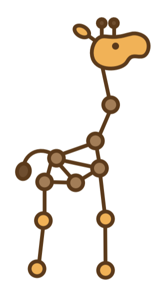

# Jraph - A library for graph neural networks in jax.


## New! PMAP Examples and Data Loading.

We have added a pmap [example](https://github.com/deepmind/jraph/tree/master/jraph/ogb_examples/train_pmap.py).

Our friends at instadeep, Jama Hussein Mohamud and Tom Makkink
have put together a nice guide to using pytorch data loading. Find it [here](https://colab.research.google.com/drive/1_X2su92_nS52RNl4m-WYvmkvUSrFE4xQ).


## New! Support For Large Distributed MPNNs

We have released a distributed graph network implementation that allows you to
distribute a very large (millions of edges) graph network with explicit edge
messages across multiple devices. [**Check it out!**](https://github.com/deepmind/jraph/tree/master/jraph/experimental)

## New! Interactive Jraph Colabs

We have two new colabs to help you get to grips with Jraph.

The first is an educational colab with an amazing introduction to graph neural networks, graph theory,shows you how to use Jraph to solve a number of problems. Check it out [**here**.](https://github.com/deepmind/educational/blob/master/colabs/summer_schools/intro_to_graph_nets_tutorial_with_jraph.ipynb)

The second is a fully working example with best practices of using Jraph with OGBG-MOLPCBA with some great visualizations. Check it out [**here**.](https://github.com/google/flax/tree/main/examples/ogbg_molpcba) 

Thank you to Lisa Wang, Nikola Jovanović & Ameya Daigavane.

## Quick Start

[**Quick Start** ](#quick-start)|[ **Documentation** ](https://jraph.readthedocs.io/en/latest/)

Jraph (pronounced "giraffe") is a lightweight library for working with graph
neural networks in jax. It provides a data structure for graphs, a set of
utilities for working with graphs, and a 'zoo' of forkable graph neural network
models.

## Installation

```pip install jraph```

Or Jraph can be installed directly from github using the following command:

```pip install git+git://github.com/deepmind/jraph.git```

The examples require additional dependencies. To install them please run:

```pip install "jraph[examples, ogb_examples] @ git+git://github.com/deepmind/jraph.git"```

## Overview

Jraph is designed to provide utilities for working with graphs in jax, but
doesn't prescribe a way to write or develop graph neural networks.

*   `graph.py` provides a lightweight data structure, `GraphsTuple`, for working
    with graphs.
*   `utils.py` provides utilities for working with `GraphsTuples` in jax.
    *   Utilities for batching datasets of `GraphsTuples`.
    *   Utilities to support jit compilation of variable shaped graphs via
        padding and masking.
    *   Utilities for defining losses on partitions of inputs.
*   `models.py` provides examples of different types of graph neural network
    message passing. These are designed to be lightweight, easy to fork and
    adapt. They do not manage parameters for you - for that, consider using
    `haiku` or `flax`. See the examples for more details.


## Quick Start

Jraph takes inspiration from the Tensorflow [graph_nets library](https://github.com/deepmind/graph_nets) in defining a `GraphsTuple`
data structure, which is a namedtuple that contains one or more directed graphs.

### Representing Graphs - The `GraphsTuple`

```python
import jraph
import jax.numpy as jnp

# Define a three node graph, each node has an integer as its feature.
node_features = jnp.array([[0.], [1.], [2.]])

# We will construct a graph for which there is a directed edge between each node
# and its successor. We define this with `senders` (source nodes) and `receivers`
# (destination nodes).
senders = jnp.array([0, 1, 2])
receivers = jnp.array([1, 2, 0])

# You can optionally add edge attributes.
edges = jnp.array([[5.], [6.], [7.]])

# We then save the number of nodes and the number of edges.
# This information is used to make running GNNs over multiple graphs
# in a GraphsTuple possible.
n_node = jnp.array([3])
n_edge = jnp.array([3])

# Optionally you can add `global` information, such as a graph label.

global_context = jnp.array([[1]])
graph = jraph.GraphsTuple(nodes=node_features, senders=senders, receivers=receivers,
edges=edges, n_node=n_node, n_edge=n_edge, globals=global_context)
```

A `GraphsTuple` can have more than one graph.

```python
two_graph_graphstuple = jraph.batch([graph, graph])
```

The node and edge features are stacked on the leading axis.

```python
jraph.batch([graph, graph]).nodes
>>> DeviceArray([[0.],
             [1.],
             [2.],
             [0.],
             [1.],
             [2.]], dtype=float32)
```

You can tell which nodes are from which graph by looking at `n_node`.

```python
jraph.batch([graph, graph]).n_node
>>> DeviceArray([3, 3], dtype=int32)
```

You can store nests of features in `nodes`, `edges` and `globals`. This makes
it possible to store multiple sets of features for each node, edge or graph, with
potentially different types and semantically different meanings (for example
'training' and 'testing' nodes). The only requirement if that all arrays within
each nest must have a common leading dimensions size, matching the total number
of nodes, edges or graphs within the `Graphstuple` respectively.

```python
node_targets = jnp.array([[True], [False], [True]])
graph = graph._replace(nodes={'inputs': graph.nodes, 'targets': node_targets})
```

### Using the Model Zoo

Jraph provides a set of implemented reference models for you to use.

A Jraph model defines a message passing algorithm between the nodes, edges and
global attributes of a graph. The user defines `update` functions that update graph features, which are typically neural networks but can be arbitrary jax functions.

Let's go through a `GraphNetwork` [(paper)](https://arxiv.org/abs/1806.01261) example.
A GraphNet's first update function updates the edges using `edge` features,
the node features of the `sender` and `receiver` and the `global` features.


```python
# As one example, we just pass the edge features straight through.
def update_edge_fn(edge, sender, receiver, globals_):
  return edge
```

Often we use the concatenation of these features, and `jraph` provides an easy
way of doing this with the `concatenated_args` decorator.

```python
@jraph.concatenated_args
def update_edge_fn(concatenated_features):
  return concatenated_features
```
Typically, a learned model such as a Multi-Layer Perceptron is used within an
update function.

The user similarly defines functions that update the nodes and globals. These
are then used to configure a `GraphNetwork`. To see the arguments to the node
and global `update_fns` please take a look at the model zoo.

```python
net = jraph.GraphNetwork(update_edge_fn=update_edge_fn,
                         update_node_fn=update_node_fn,
                         update_global_fn=update_global_fn)
```

`net` is a function that sends messages according to the `GraphNetwork` algorithm
and applies the `update_fn`. It takes a graph, and returns a graph.

```python
updated_graph = net(graph)
```


## Examples

For a deeper dive best place to start are the examples. In particular:

*  `examples/basic.py` provides an introduction to the features of the library.
*  `ogb_examples/train.py` provides an end to
end example of training a `GraphNet` on `molhiv` Open Graph Benchmark dataset.
Please note, you need to have downloaded the dataset to run this example.

The rest of the examples are short scripts demonstrating how to use various
models from our model zoo, as well as making models go fast with `jax.jit`, and
how to deal with Jax's static shape requirement.


## Citing Jraph

To cite this repository:

```
@software{jraph2020github,
  author = {Jonathan Godwin* and Thomas Keck* and Peter Battaglia and Victor Bapst and Thomas Kipf and Yujia Li and Kimberly Stachenfeld and Petar Veli\v{c}kovi\'{c} and Alvaro Sanchez-Gonzalez},
  title = {{J}raph: {A} library for graph neural networks in jax.},
  url = {http://github.com/deepmind/jraph},
  version = {0.0.1.dev},
  year = {2020},
}
```
